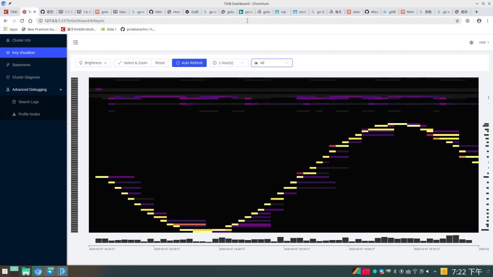

# pingcap_demo

## Description

  编写一个程序，语言任意，程序运行起来后，能在 TiDB Key Visualizer 上显示出明亮的正弦曲线。相关参考资料（可自行寻找其他资料）：
- https://mp.weixin.qq.com/s/X3dodzwRhF4QX7fiL9yUTg 
- https://mp.weixin.qq.com/s/EKv-PvJUl0Bdn25SVzrJwQ

## Build

``` bash
  ## get binary 
  wget http://download.pingcap.org/tidb-latest-linux-amd64.tar.gz
  tar -xzvf tidb-latest-linux-amd64.tar.gz
  cd tidb-latest-linux-amd64
  mkdir data
  mkdir data/logs

  ## start tidb
  ## pd > tikv > tidb
  ./bin/pd-server --data-dir=./data/pd --log-file=./data/logs/pd.log &
  ./bin/tikv-server --pd="127.0.0.1:2379" --data-dir=./data/tikv --log-file=./data/logs/tikv.log &
  ./bin/tidb-server --store=tikv --path="127.0.0.1:2379" --log-file=./data/logs/tidb.log &

  ## start demo
  go run demo.go
```

## Timeline

- 3.2～3.4 研究文档，企图用docker搭建，后来发现pd的版本不太够，clone新的pd，make完发现自己网络太差了，没法去做新的docker编译文件（，gg.gg; 学习mysql...，复（预）习go（顺便自闭课程设计）
- 3.5 自闭 + 开始研究viz的构成，发现了很多我没法解释的问题，但是找到了好像靠谱的解决方案...写了个最初始的demo
- 3.6 写了看起来靠谱的demo（实际上并不靠谱）
- 3.7 调试&test

## Presitation



## Problem

感觉自己对这套数据库其实并不是很了解吧orz（啊我的数据库水平停留在自己写过的一点sqlite...

- 从viz上看到了很长的延时，我猜可能是pd调度的问题？
- 我有尝试删掉table，但是我发现他并不能在table上消失哎，大概等了一天都不会消失...不是很懂（

## TODO
- 这sin也太丑了...
- 企图修改一点时间函数让看起来有延时的时候变短一点orz
- （虽然我觉得我好像也不会todo了？
